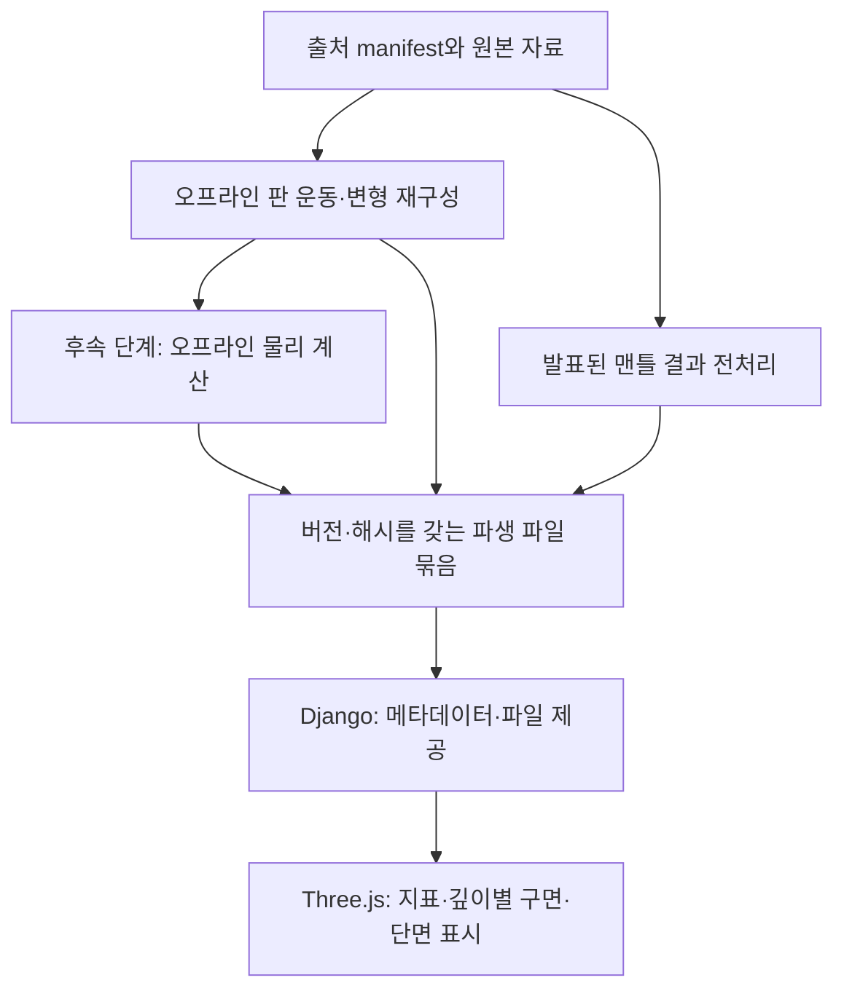

# jikhanjung P03 — 지각 변형과 맨틀 대류 연결

날짜: 2026-09-15 · 기준 버전: v0.10.5 · 브랜치: feature/crustal-deformation-mantle · 상태: 첫 단계 구현 중

구현 기록: [jikhanjung 066](20260915_jikhanjung_066_mantle_source_preview.md).
지역 팝업과 수직 과장·3D 지표 비교는 [jikhanjung 067](20260915_jikhanjung_067_india_asia_section.md)에 기록했다.
자료 manifest·변형 네트워크 목록과 OPT1 표면 미리보기를 구현했다. 실제 저해상도
아카이브는 온도 격자가 아닌 추출된 3D 표면이므로, 아래 C의 온도 단면에 앞서 이 표면을
표시했다. 51개 원본 시점의 간격은 20 Ma다. A의 좌표계 정합과 B 이후의 지각 변형
계산은 아직 완료하지 않았다. 아래 조사 당시 제안과 구분되는 확인 결과는 구현 기록을 따른다.

## 목적과 범위

Scotese 고지리의 시기별 모습을 지구본에 표시하는 단계에서, 판의 이동과 지각의
늘어남·줄어듦을 시간에 따라 재구성하는 단계로 확장한다. 인도–유라시아 충돌과
히말라야 형성을 첫 지역 사례로 삼고, 이후 맨틀의 흐름과 지표 변형 사이의 관계를 실험한다.

첫 목표는 발표된 판 운동과 지질 자료에 맞춘 **운동학적 복원**이다. 맨틀 대류를 직접
풀어야 지각 변형을 표현할 수 있는 것은 아니다. 운동학적 복원을 먼저 만들고, 발표된
맨틀 계산 결과의 시각화, 경계조건을 주는 물리 모사, 양방향 결합의 순서로 진행한다.
각 단계는 다른 종류의 결과이며, 맨틀 그림을 겹쳤다고 지각 운동의 원인을 검증한 것은 아니다.

이 문서의 최초 제안은 논문·공식 문서·자료 배포 페이지를 조사한 계획이다. 아래 신규 자료의 실제
아카이브 내용, 라이선스, 변수와 시간 간격은 도입 단계에서 확인한다. 데이터 다운로드나
솔버 실행, 구현 완료를 뜻하지 않는다.

## 현재 출발점

- Django 5.2와 Three.js 뷰어, Scotese 아틀라스와 PaleoDEM 지형, 판 회전 자료 및 벡터
  오버레이를 이용할 수 있다. 구조는 [뷰어 문서](../docs/globe-viewer.md)에 기록되어 있다.
- 현재 표면의 이동 표현은 영역의 대표 위치를 판 회전으로 옮기고 주변 형상을 보간하는
  방식이다. 물질을 따라 움직이는 변형 격자나 지각 두께·응력의 계산은 구현되어 있지 않다.
- [Müller 2022 manifest](../sources/plate-models/muller2022.json)의 맨틀 기준 좌표계 회전은
  이미 사용하는 판 모형 자료다. 아래 Müller 2019의 변형 네트워크나 Müller 2022의 맨틀
  온도장 자료가 도입되었다는 뜻은 아니다.
- [P02](20260915_jikhanjung_P02_last_glacial_cycle.md)의 최근 13만 년 화면은 1 ka 눈금을
  제공한다. 이 시간 눈금과 장기 판 운동 복원의 시간 해상도는 별개다.
- 원본 출처는 `sources/`, 전처리는 `scripts/`, 원본 및 파생 파일은 `data/sources/`와
  `data/derived/`로 관리하는 기존 흐름을 확장한다. 대용량 계산은 웹 요청 밖에서 수행한다.

## 우선 조사·도입할 자료

| 우선순위 | 자료 | 프로젝트에서 맡을 역할 | 확인할 조건과 한계 |
|---|---|---|---|
| 1 | [Müller et al. 2019 변형 판 모형](https://zenodo.org/records/10525287), [논문](https://doi.org/10.1029/2018TC005462) | 트라이아스기 이후 열개대·조산대의 변형 네트워크, 회전과 내부 강체 블록을 이용한 지각 복원 | v1.2 ZIP 약 37.5 MB. 배포된 License.txt와 네트워크의 실제 지역·연대 범위 확인. 인도 지역의 필요한 구속조건이 모두 포함된다고 가정하지 않는다. |
| 2 | [Müller et al. 2022 논문](https://se.copernicus.org/articles/13/1127/2022/)과 [맨틀 계산 부속 자료](https://zenodo.org/records/6622194) | 기존에 계산된 맨틀 온도 이상장을 깊이별 구면과 단면으로 표시 | OPT1 저해상도 ParaView 자료 약 205.8 MB, OPT1·OPT2 온도 이상 NetCDF 자료 각각 약 2.3 GB. 파일별 라이선스, 시간·깊이·단위·좌표계 확인. 속도장 포함 여부는 미확인이다. |
| 3 | [인도–유라시아 및 테티스 해양 내 호 충돌 모형](https://www.earthbyte.org/a-tectonic-model-reconciling-evidence-for-the-collisions-between-india-eurasia-and-intra-oceanic-arcs-of-the-central-eastern-tethys/) | 인도 이동, 소멸한 해양과 호, 충돌 순서를 지역 시나리오로 구체화 | 2015년 발표된 하나의 해석이다. 충돌 시기와 Greater India 형상 등은 다른 해석과 비교할 가정으로 남긴다. |
| 4 | [CRUST1.0](https://igppweb.ucsd.edu/~gabi/crust1.html), [Slab2](https://www.usgs.gov/software/slab2) | 현재 지각 두께와 섭입판 형상을 종점 비교 자료로 활용 | CRUST1.0은 1°의 거친 현재 지각 모형이다. Slab2는 제공 지역의 현재 섭입 구조이며 사라진 테티스나 히말라야 전체 구조를 직접 제공하지 않는다. |
| 5 | [EarthByte 동적 지형 모형](https://www.earthbyte.org/global-dynamic-topography-models/) | 맨틀 유동에 따른 장파장 지표 변위의 비교 레이어 | PaleoDEM에 바로 더하지 않는다. 이미 포함된 지형 성분과 중복되지 않도록 기준면과 잔차 정의가 필요하다. |

표의 크기는 배포 페이지에 기재된 값이다. 논문의 공개 라이선스가 모든 부속 파일에도
적용된다고 가정하지 않는다. 사용·수정·재배포 조건을 파일 단위로 확인하고 기존
[자료 라이선스 정책](../LICENSE-DATA.md)에 맞는 것만 배포 묶음에 넣는다.

## 단계별 구현과 완료 조건

### A. 자료 목록과 좌표·시간 규약 확정

Müller 2019의 회전, 동적 위상, 변형 네트워크, 내부 강체 블록을 목록화한다.
현재 윤곽선·회전 추출 과정에서 잃는 정보가 무엇인지 확인한다. Müller 2022 맨틀 자료는
저해상도 OPT1부터 확인하고, 시점 하나와 깊이 하나를 읽어 원래 ParaView 결과와 비교한다.

두 모형과 PALEOMAP 지표가 같은 기준 좌표계에 있는지 검토한다. 서로 다른 모형에서 온
대륙과 맨틀 구조를 단순히 겹치지 않는다. 가능한 경우 시점별 좌표 변환을 명시하고,
불가능하면 별도 모형 보기로 제공한다. 위치뿐 아니라 속도 벡터도 같은 규약으로 변환한다.

완료 조건은 자료별 manifest에 출처·버전·해시·라이선스·연대 범위·단위·좌표계와
실제 변수 목록이 기록되고, 작은 표본을 재현 가능한 명령으로 읽을 수 있는 것이다.

### B. 판 운동을 따르는 변형 격자

강체 판은 격자의 각 정점을 구면 유한 회전으로 이동시킨다. 변형 네트워크는 경계와
내부 강체 블록을 유지하며, 해당 모형의 속도장으로 물질 격자를 이동시킨다.
가능하면 GPlates/pyGPlates의 재구성 기능을 이용하고, 먼저 고정 버전의 지원 API를 확인한다.
형상 간 단순 보간만으로 물질의 이동이나 변형률을 정의하지 않는다.

첫 표시 변수는 수평 속도, 면적 변화, 변형률과 변형률 속도다. 변형률은 무차원,
변형률 속도는 시간의 역수이므로 구분한다. 판 경계 변경, 물질의 생성·섭입·이탈은
위상 사건으로 기록하고, 사건을 가로질러 삼각형을 무조건 보간하지 않는다.

완료 조건은 선택 지역과 몇 개 원본 시점에서 기준 재구성과 일치하고, 강체 영역에서
가짜 변형이 생기지 않으며, 극·날짜변경선에서 격자가 뒤집히거나 찢어지지 않는 것이다.
재격자화가 필요하면 물질 식별자와 누적 변형량의 전달 오차도 기록한다.

### C. 발표된 맨틀 모형을 지구본 내부에 표시

OPT1 온도 이상장을 깊이별 구면, 인도–티베트 방향 수직 단면으로 표시한다.
등온도 이상면은 자료량과 브라우저 성능을 확인한 뒤 추가한다. 필요한 시간과 깊이만
전처리·전송하고 원본 전체를 브라우저에 올리지 않는다.

범례에는 온도 이상장의 단위, 기준 온도 정의, 모형명과 시점을 표시한다.
온도 이상은 속도가 아니다. 속도 변수가 확인되지 않으면 유동 화살표나 이동 입자로
흐름을 주장하지 않는다. 지진파 단층촬영 역시 현재의 지진파 속도 모형이며,
과거 온도·흐름의 직접 관측으로 취급하지 않는다.

완료 조건은 원본과 단면의 위치·값·색 범위를 대조하고, 원본 시점과 보간 시점을
구별하며, 모형 지표와 맨틀의 기준 좌표계가 일치하거나 차이가 명시되는 것이다.
이 단계는 발표된 계산의 시각화이며 자체 대류 계산은 아니다.

### D. 인도–유라시아 지역의 변형과 지형 시나리오

첫 실험 범위는 **80 Ma–현재를 제안**한다. 실제 시작 시점과 공간 범위는 자료 범위를
확인한 후 정한다. 특정 연대를 유일한 충돌 시점으로 고정하지 않고, 충돌 순서와
인도 북쪽의 초기 형상을 시나리오 입력으로 둔다.

판 상대운동, 봉합대·지체구조 경계, 단축량과 단축 시기, 지각 두께, 고지자기 및
고고도 자료를 별도의 제약으로 모은다. 현재 GNSS는 현재 속도의 검증에만 사용한다.
지역 지각 자료는 CRUST1.0보다 세밀한 수신함수·탄성파 연구 등을 추가 조사한다.

초기 지각 두께를 가정하고, 물질이 드나들지 않는 부분에서는 체적 보존에 따른
면적 변화와 두께 변화를 연결하는 단순 모형부터 시험한다. 섭입·침식·퇴적이 있으면
해당 물질 수지를 따로 둔다. 지각이 두꺼워진 양을 그대로 산의 높이로 쓰지 않고,
밀도와 등압평형 가정을 명시한 지형 추정부터 시작한다. 탄성 휨과 침식은 후속 확장이다.

완료 조건은 이동·단축·두께·고도 결과를 각각 구속 자료와 비교하고, 초기 두께나
충돌 시나리오를 바꿨을 때 결과가 얼마나 달라지는지 제시하는 것이다. PaleoDEM과
비슷한 산 모양을 만드는 것만으로 물리 모형의 검증을 대신하지 않는다.

### E. 오프라인 맨틀 계산과 지역 모형 연결

발표된 Müller 2022 계산을 재현하려면 해당 연구의
[EarthByte CitcomS](https://github.com/EarthByte/citcoms)와 부속 입력을 우선 검토한다.
새로운 지역 실험은 [ASPECT](https://aspect.geodynamics.org/)를 후보로 둔다.
두 솔버를 동시에 도입하지 않고, 재현 또는 새 실험 중 첫 목적에 맞춰 선택한다.

[ASPECT의 GPlates 경계조건 예제](https://aspect-documentation.readthedocs.io/en/latest/user/cookbooks/cookbooks/gplates/doc/gplates.html)는
회전·판 모형에서 지표 속도를 입력하는 출발점이다. 대륙 윤곽선만으로는 해양을 포함한
계산 영역 전체의 속도를 정의할 수 없으므로 전체 영역을 덮는 판 위상이 필요하다.
[전 지구–지역 연결 예제](https://aspect-documentation.readthedocs.io/en/latest/user/cookbooks/cookbooks/global_regional_coupling/doc/global_regional_coupling.html)는
전 지구 계산 결과를 지역 경계에 전달하는 구조를 검토하는 데 사용한다.

먼저 알려진 대류 벤치마크로 솔버 설정을 확인한다. 이후 온도·깊이에 따른 점성,
기준 온도와 밀도, 상하부 열 경계조건, 해양판 연령에 따른 열 구조, 슬랩 형상,
초기 상태와 준비 계산 구간을 입력으로 명시한다. 지역 경계의 속도·온도·응력은
솔버 지원 범위에 맞춰 선택하며, 같은 자유도에 속도와 응력을 중복 지정하지 않는다.

초기 목표는 **주어진 판 운동 → 맨틀의 반응**이라는 단방향 계산이다. 이것으로 판 운동을
독립적으로 예측했다고 주장하지 않는다. 현재 구조를 단순히 역재생하여 과거 맨틀을
얻을 수 있다고 가정하지 않으며, 여러 초기 상태를 비교한다. 2D 단면은 설정 실험에
사용할 수 있지만 구면 3D 충돌 역학의 검증을 대신하지 않는다.

완료 조건은 입력·솔버 버전·격자·실행 명령으로 결과를 재생성할 수 있고, 시간 간격과
격자를 바꾼 수렴성 및 경계조건 민감도를 보고하는 것이다. 판 운동을 맨틀과 함께
풀어내는 양방향 결합은 이 단계 이후 별도 연구 계획으로 다룬다.

## 시간과 데이터 계약

1만 년 눈금은 사용자가 선택할 수 있는 **표시 간격**이다. 원본 자료의 시간 간격,
수치 계산의 시간 간격, 저장할 출력 간격은 각각 따로 둔다. 예를 들어 수백만 년 간격
자료 사이를 1만 년씩 그려도 중간 사건을 그 정밀도로 알고 있다는 뜻은 아니다.
수치 계산 간격은 안정성·수렴성으로 정하고, 위상 사건 전후는 별도 처리한다.

| 항목 | 저장 원칙 |
|---|---|
| 시간 | 지질학적 나이는 `age_ma`로 현재 이전을 양수로 기록한다. 솔버 경과 시간과 분리하며 현재로 진행할수록 나이는 감소한다. |
| 공간 | 구면 반지름, 깊이의 부호, 위경도 또는 직교좌표, 좌표축·벡터 성분 규약, 기준 좌표계와 변환을 기록한다. |
| 물리량 | 속도·온도 이상·두께·변형률·변형률 속도의 단위와 기준 상태, 결측값, 값의 위치가 절점인지 셀인지 기록한다. |
| 출처 | 관측 제약, 발표된 복원, 프로젝트 보간, 물리 계산 결과를 구분한다. 혼합 결과는 구성 자료와 처리 이력을 남긴다. |
| 재현 | 원본 URL·DOI·버전·해시·라이선스, 전처리 버전, 솔버 설정과 시나리오 ID를 기록한다. |
| 불확실성 | 자료 연대 오차, 모형 간 차이, 초기 상태·물성·충돌 가정의 차이를 구분한다. 추정하지 않은 오차 범위를 임의로 만들지 않는다. |

## 프로젝트 반영 구조

새 manifest와 스크립트 이름은 구현 단계에서 정하되 기존 저장소 구조를 따른다.
메시·볼륨 같은 대형 배열은 파일로 두고 Django에는 조회와 시나리오 메타데이터를 맡긴다.
뷰어는 선택 시점·지역·깊이와 해상도에 필요한 데이터만 불러온다. 원본 계산 해상도와
화면 표시 해상도를 별도로 기록한다.

새 데이터 묶음은 기존 배포 검증 흐름에 연결한다. 초기 단면으로 실제 다운로드 크기,
GPU 메모리와 렌더링 시간을 측정한 후 축소 해상도와 캐시 정책을 정한다.
운영 DB나 웹 요청 안에서 솔버를 실행하는 구조는 사용하지 않는다.

동적 지형은 우선 비교 레이어로 제공한다. PaleoDEM과 합성하려면 어떤 기저 지형에서
어떤 성분을 제거하고 어떤 맨틀 기여를 더했는지 먼저 정의한다. 침식·하천 변화는
별도 지표 과정이며, 진행 중인 하천 표시 작업과 물리적 침식 계산을 구분한다.

## 다음 작업의 순서

- [ ] Müller 2019 네트워크와 Müller 2022 저해상도 OPT1의 사용 조건·실제 변수·좌표계를 확인하고 manifest 초안을 만든다.
- [ ] 변형 네트워크 한 지역·원본 두 시점과 맨틀 단면 한 시점을 추출하여 기준 출력과 비교한다.
- [ ] 지각과 맨틀 사이 좌표계 변환의 가능 여부를 판정하고, 첫 데모 범위와 데이터 계약을 확정한다.
- [ ] 변형 격자와 온도 이상 단면을 각각 구현하고 자료 종류·보간 상태를 화면에 표시한다.
- [ ] 인도–유라시아의 구속 자료를 모아 두께·고도 시나리오를 비교한다.
- [ ] 앞 단계 검증 후 솔버 하나를 선정하여 벤치마크와 단방향 결합 실험을 진행한다.

전 지구·전 연대를 한 번에 물리적으로 예측하거나, 맨틀 대류만으로 모든 판 운동을
도출하는 것은 이번 첫 구현 범위에 넣지 않는다. 각 단계의 완료 조건을 충족한 뒤
다음 단계의 계산 규모와 과학적 주장을 정한다.
